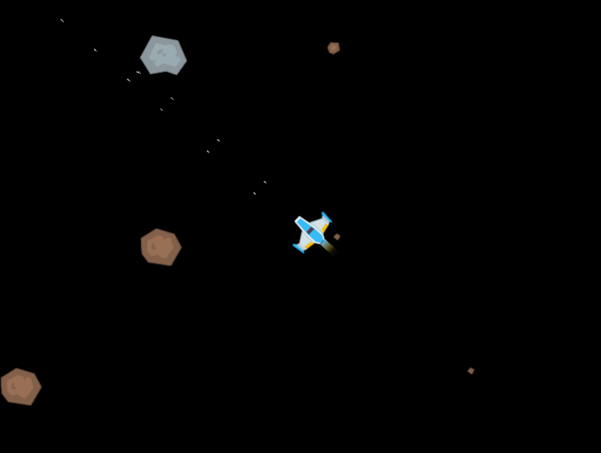

This is a simple space game.\
I am making it in my spare time for fun and learning.\
Feel free to use it as template for your own things.\
\
\
\
Implemented features:\
~ Moving forward, backward, left, right, angular.\
~ Extreme (fast) breaking (to full stop).\
~ Increasing/decreasing max speed.\
~ Choose weapon type (one/two bullets for now).\
~ Shots interval (100 ms).\
~ Impulses (for moving) calculates depending on ship mass.\
~ Bullet/asteroid contact (collision) animation.\
\
Made with:\
~ Physics  - [rapier](https://github.com/dimforge/rapier).\
~ Graphics - [macroquad](https://github.com/not-fl3/macroquad).\
~ Assets   - [kenney](http://kenney.nl).\
~ ECS      - [bevy_ecs](https://docs.rs/bevy_ecs/latest/bevy_ecs).\
~ Lang     - [rust](https://www.rust-lang.org).\
\
Control keys:\
~ 1        - Change weapon to one bullet.\
~ 2        - Change weapon to two bullets.\
~ A        - Move left.\
~ D        - Move right.\
~ Up       - Move forward.\
~ Down     - Move backward.\
~ Left     - Turn left.\
~ Right    - Turn right.\
~ Minus    - Minimize speed.\
~ Plus(=)  - Maximize speed.\
~ Q        - Decrease speed (slowly).\
~ E        - Increase speed (slowly).\
~ Space    - Brake (extreme).\
~ W        - Shoot.\
~ Ctrl+I   - Zoom in.\
~ Ctrl+O   - Zoom out.\
~ Ctrl+F   - Fullscreen on/off.\
